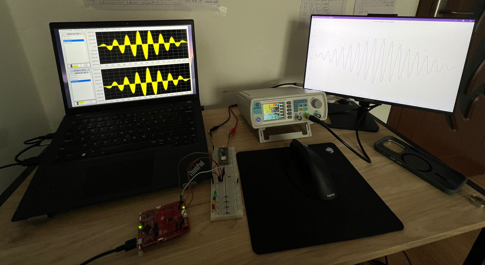
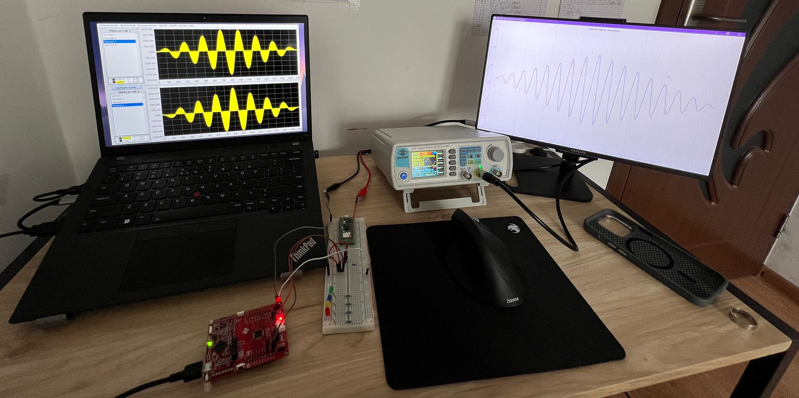

# MSP430FR2355 Convolution & Correlation

A real-time signal processing project built on the **MSP430FR2355** microcontroller, with a Python-based PC dashboard for live visualization of **convolution** and **cross-correlation** results.

<p align="center">
  
</p>

<p align="center">
  
</p>

---

## Overview

The system acquires two analog input signals using the on-chip ADC, computes either **linear convolution** or **cross-correlation** on the MSP430, and transmits the processed output to a PC over UART for live plotting. The active processing mode is selected with hardware buttons, while LEDs indicate whether the board is currently operating in convolution or correlation mode. 

---

## Hardware

**Target MCU:** Texas Instruments MSP430FR2355 

| Pin | Function |
|-----|----------|
| P1.1 / A1 | Analog input signal S1  |
| P1.2 / A2 | Analog input signal S2 |
| P4.3 / UCA1TXD | UART TX → PC |
| P2.3 | Button — Convolution mode select |
| P4.1 | Button — Correlation mode select |
| P6.6 | LED — ON for convolution, OFF for correlation |
| P1.0 | LED — ON for correlation, OFF for convolution |

**Reference voltage:** 3.3 V (VCC/VSS) 
**ADC resolution:** 12-bit (0–4095)  
**Clock:** MCLK / SMCLK @ 24 MHz 

---

## Firmware (`Convolution_Correlation.c`)

### Architecture

The firmware is organized as a simple three-state machine: **`STATE_ACQUIRING`**, **`STATE_CALCULATE`**, and **`STATE_TRANSMITTING`**. It first collects 100 samples for each input signal, then computes the selected operation, and finally sends 199 processed samples to the PC through UART before restarting the acquisition cycle. [file:2]

### Signal Processing

The convolution routine removes the ADC DC offset from both signals, performs a multiply-accumulate operation over the valid overlap region, scales the result down, re-adds the midscale offset, and clips the final value to the 12-bit ADC range. The correlation routine follows the same output formatting strategy, but it shifts the second signal across the first without reversing it, producing a classic cross-correlation result that can be used to evaluate similarity or delay between the two waveforms. [file:2]

### Buffer Sizes

| Buffer | Size |
|--------|------|
| Input S1 | 100 samples |
| Input S2 | 100 samples |
| Convolution output | 199 samples |
| Correlation output | 199 samples |

### UART Frame Format

Each transmission starts with a 2-byte synchronization header, followed by 199 samples encoded as 16-bit unsigned big-endian values. Convolution packets use the header `0xAA 0xBB`, while correlation packets use `0xCC 0xDD`, allowing the Python application to detect the active mode automatically. 

| Field | Size | Description |
|-------|------|-------------|
| Sync header | 2 bytes | `0xAA 0xBB` for convolution or `0xCC 0xDD` for correlation |
| Samples | 398 bytes | 199 × 2-byte processed values |

Total frame size: **400 bytes**. 

---

## PC Dashboard (`Convolution_Correlation.py`)

The desktop application is built with **PyQtGraph**, **NumPy**, and **PySerial**. A background serial thread continuously collects UART data, searches for valid synchronization headers, decodes the payload as 16-bit big-endian samples, converts ADC units to volts, and updates the GUI through a timer-based refresh loop. 

### Features

- **Live waveform display** of the processed output signal. 
- **Automatic mode detection** based on the UART sync header. 
- **Voltage scaling** from raw ADC values to a 0–3.3 V display range. 
- **Real-time title update** showing whether the current signal is convolution or correlation. 
- **White plotting interface** with grid lines and labeled amplitude axis. 

### Configuration

Edit the constants at the top of `Convolution_Correlation.py` to match your serial setup:

```python
PORT = 'COM6'
BAUDRATE = 115200
BUFFER_SIZE_RX = 199
NUM_TRANSMISSIONS = 1
BUFFER_SIZE_PLOT = BUFFER_SIZE_RX * NUM_TRANSMISSIONS
PACKET_LEN = 2 + (BUFFER_SIZE_RX * 2)
```

These values define the COM port, baud rate, expected packet size, and plot buffer dimensions used by the GUI. 

---

## Dependencies

### Firmware
- TI MSP430 GCC toolchain or Code Composer Studio.
- Project-specific driver headers from the `drivers/` directory. 

### Python GUI
```bash
pip install pyserial pyqtgraph numpy
```

The Python script imports `serial`, `pyqtgraph`, `numpy`, `threading`, and Qt bindings through `pyqtgraph.Qt`. 

---

## Usage

1. Build and flash `Convolution_Correlation.c` to the MSP430FR2355 target board. 
2. Connect the board UART interface to the PC. 
3. Set the correct serial port in `Convolution_Correlation.py`, replacing `COM6` if needed. 
4. Run the dashboard:
   ```bash
   python Convolution_Correlation.py
   ```
5. Apply two analog input signals to **P1.1** and **P1.2**. 
6. Use **P2.3** to select convolution mode or **P4.1** to select correlation mode.

---


## Notes

- The project uses custom initialization helpers such as `board_init`, `gpio_config`, `clock_init`, `uart_init`, `timer_init`, and `adc_init`, so the `drivers/` folder must be present for a successful firmware build. 
- The ADC data is centered around midscale before processing, using an offset of 2048, which allows signed convolution and correlation math while still transmitting results in a positive 12-bit format for display. 
- The Python dashboard currently expects one full processed frame at a time and displays the most recent 199 output samples after converting them to volts.
